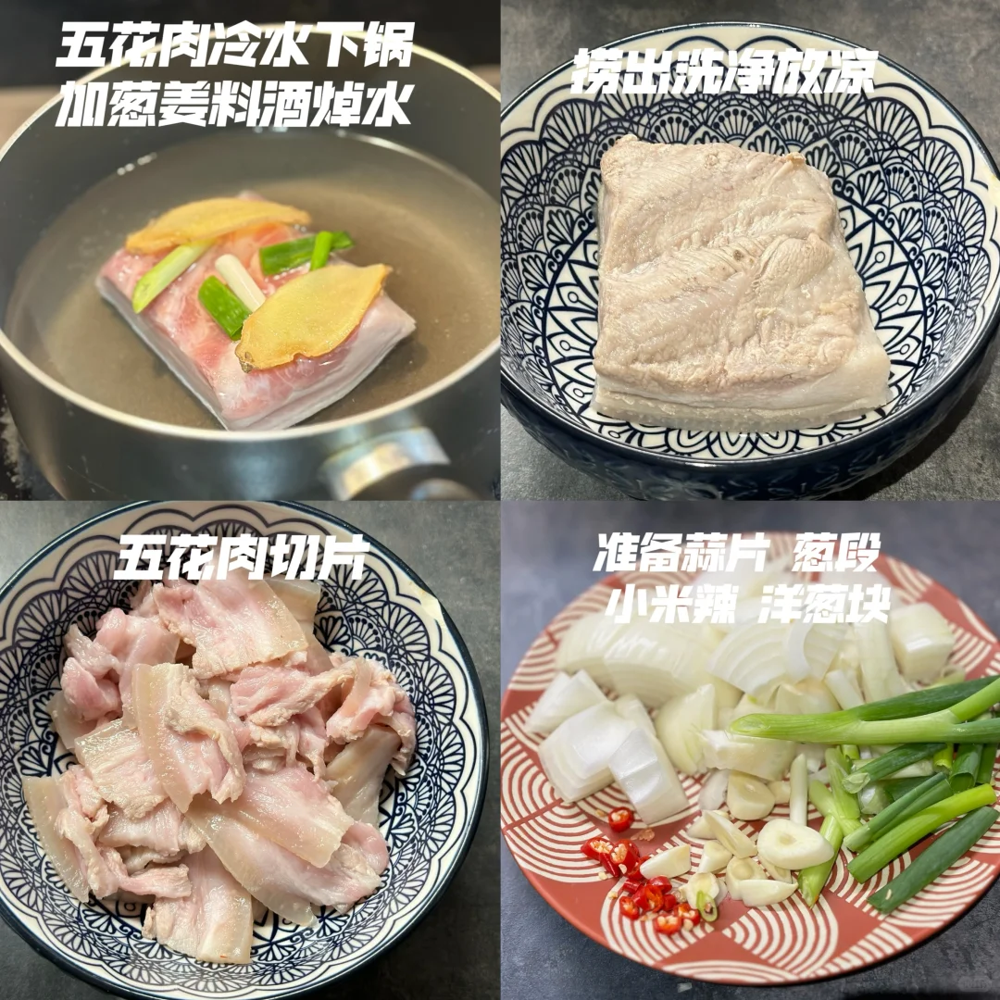
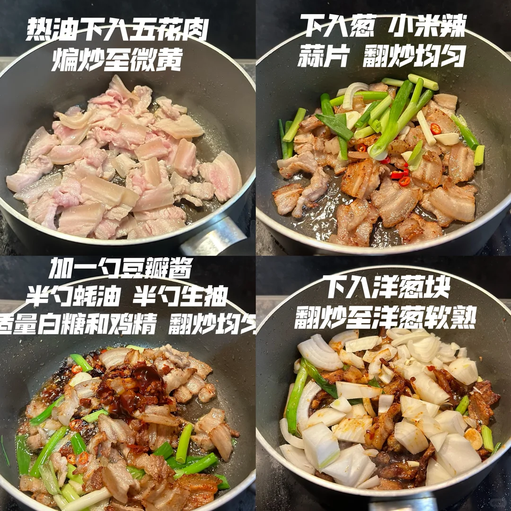
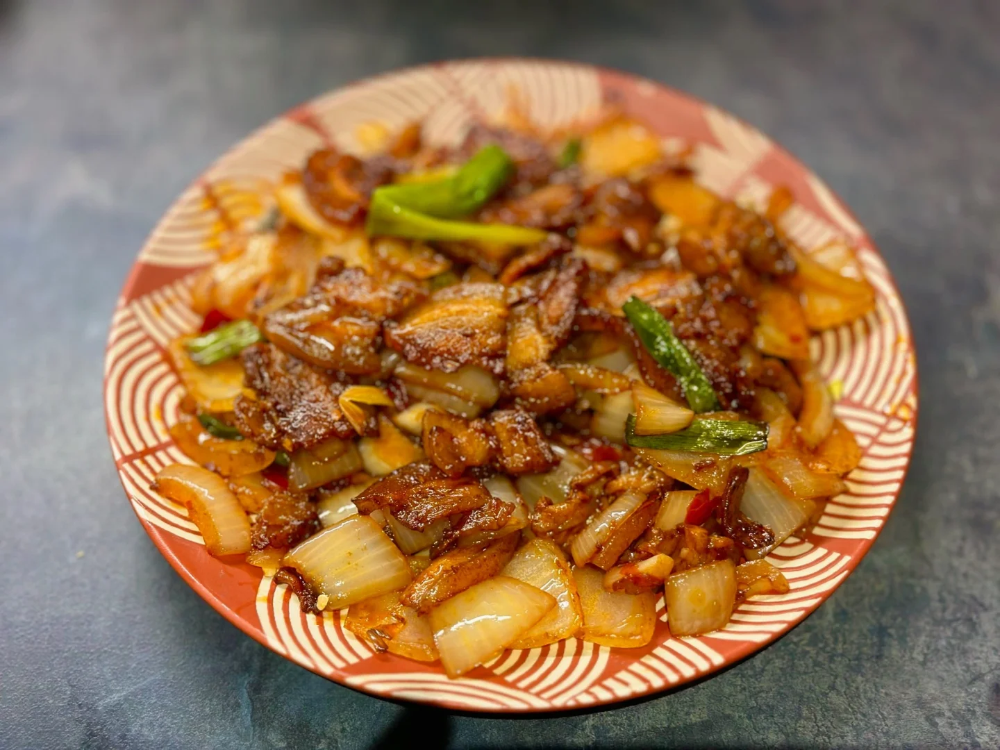
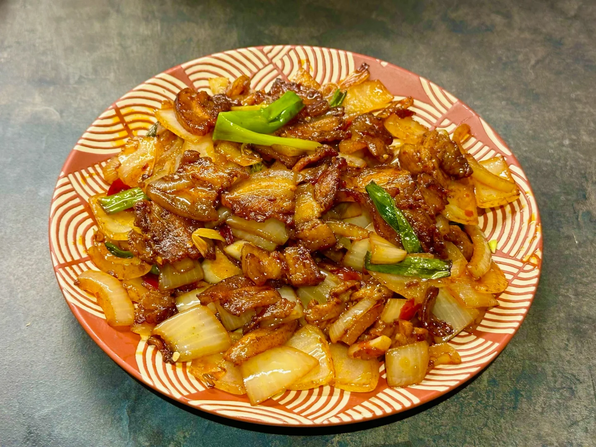

# 回锅肉

主页关注不迷路 🇬🇧做饭日记

🥄第20道菜——英国版回锅肉🍲

🥬🥩食材：猪肉

🧄🌶️佐料：洋葱 蒜片 葱 小米辣 豆瓣酱or豆豉

📜📌做法：

准备：
五花肉冷水下锅，加葱姜料酒焯水 捞出洗净放凉  切片
蒜片葱段小米辣洋葱块

1. 热油下入五花肉煸炒至微黄
2. 下入葱 小米辣 蒜片翻炒均匀
3. 加一勺豆瓣酱半勺蚝油半勺生抽适量白糖和鸡精翻炒均匀
4. 下入洋葱块 翻炒至洋葱软熟

## 图片

