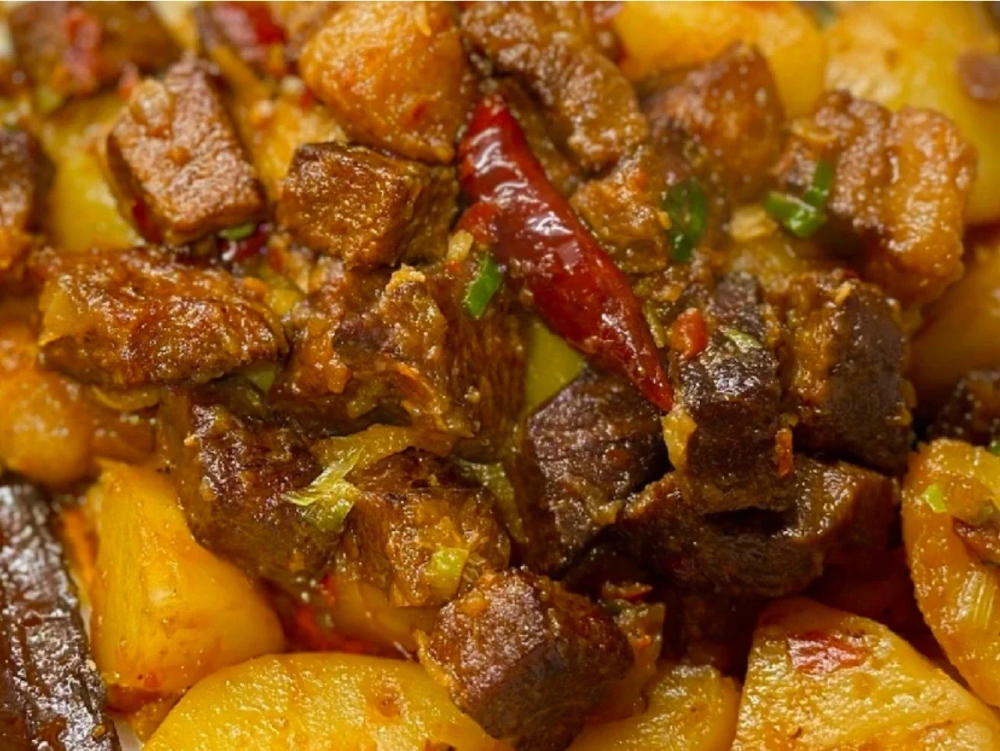
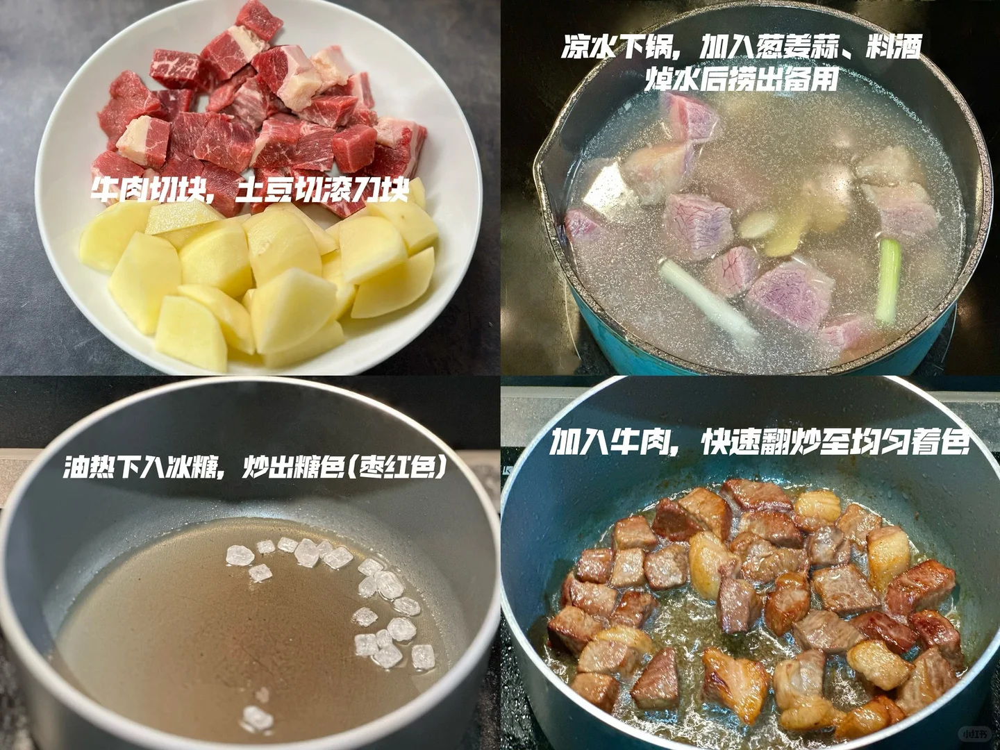
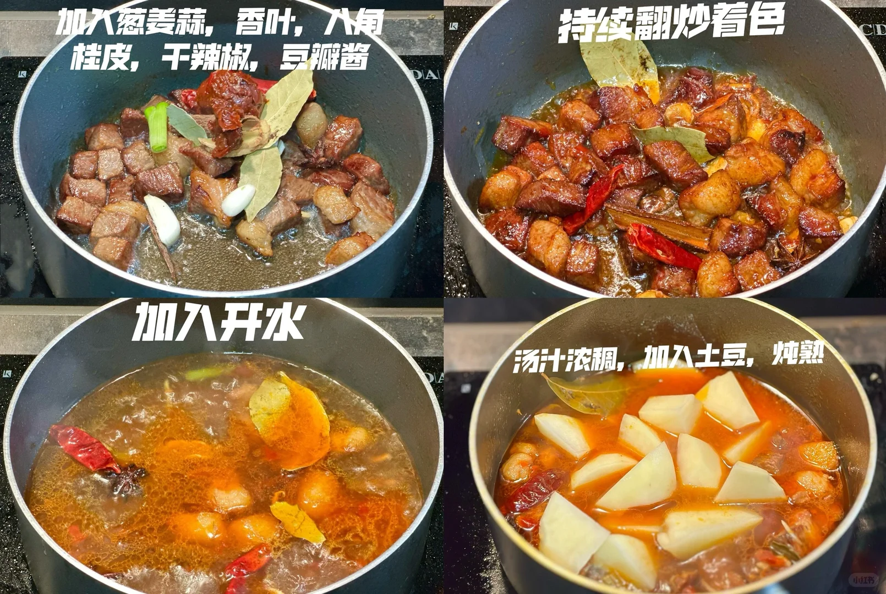
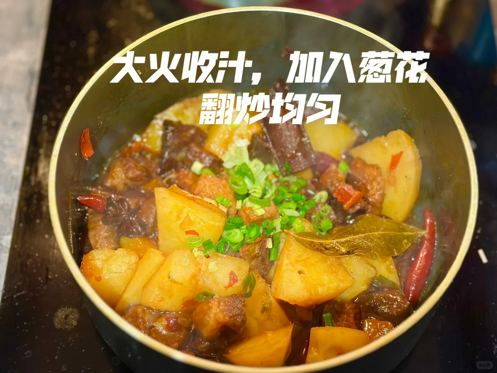
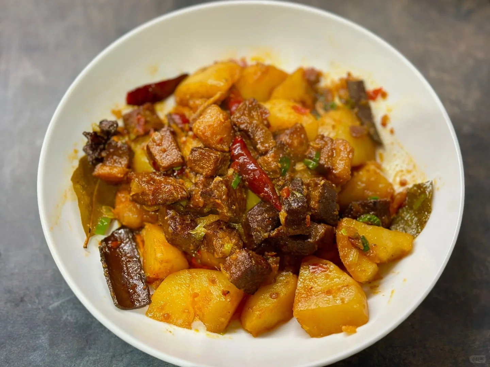

# 土豆炖牛肉

🥄第三道菜——土豆炖牛肉🍲

🥬🥩食材：牛肉、土豆

🧄🌶️佐料：葱姜蒜，冰糖，香叶，八角，桂皮，干辣椒，豆瓣酱

📜📌做法：

1. 牛肉切块，土豆切滚刀块。

2. 凉水下锅，加入葱姜蒜，料酒焯水后捞出备用。

3. 油热下入冰糖，炒出糖色(枣红色)。
加入牛肉，快速翻炒至均匀着色。
加入葱姜蒜，香叶，八角，桂皮，干辣椒，豆瓣酱。
持续翻炒着色。
加入开水。
汤汁浓稠，加入土豆，炖熟。
大火收汁，加入葱花，翻炒均匀。

## 图片

