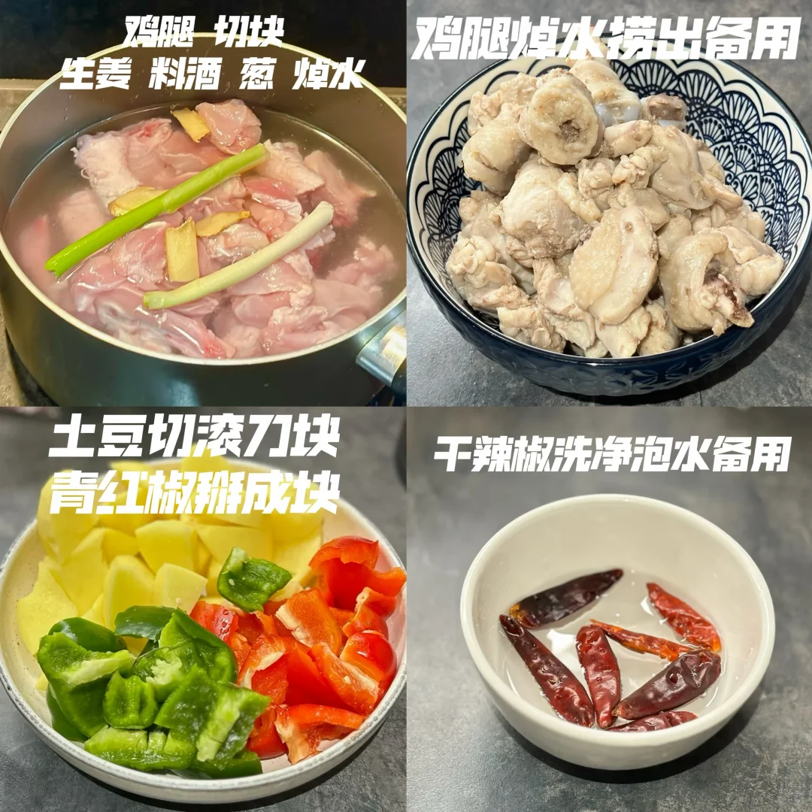
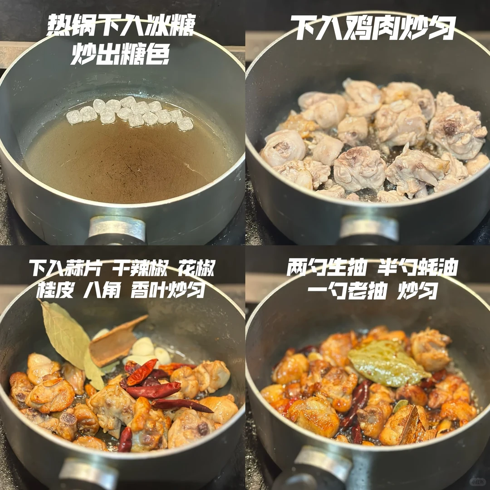
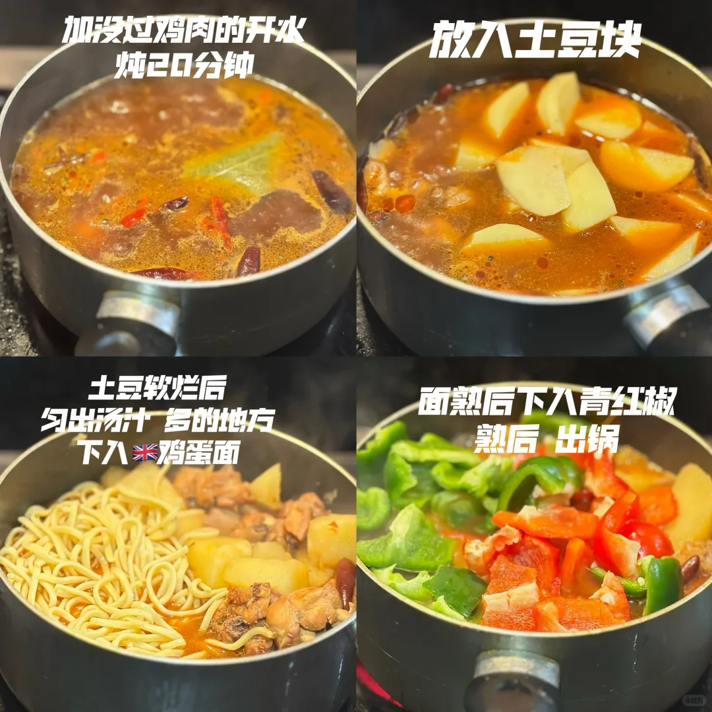
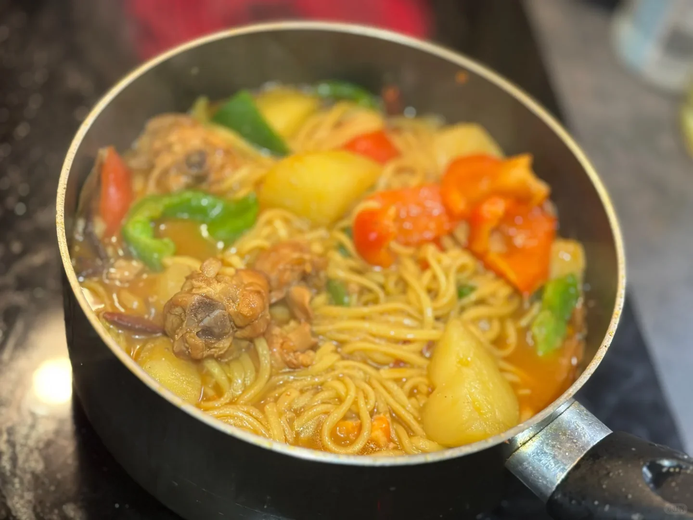
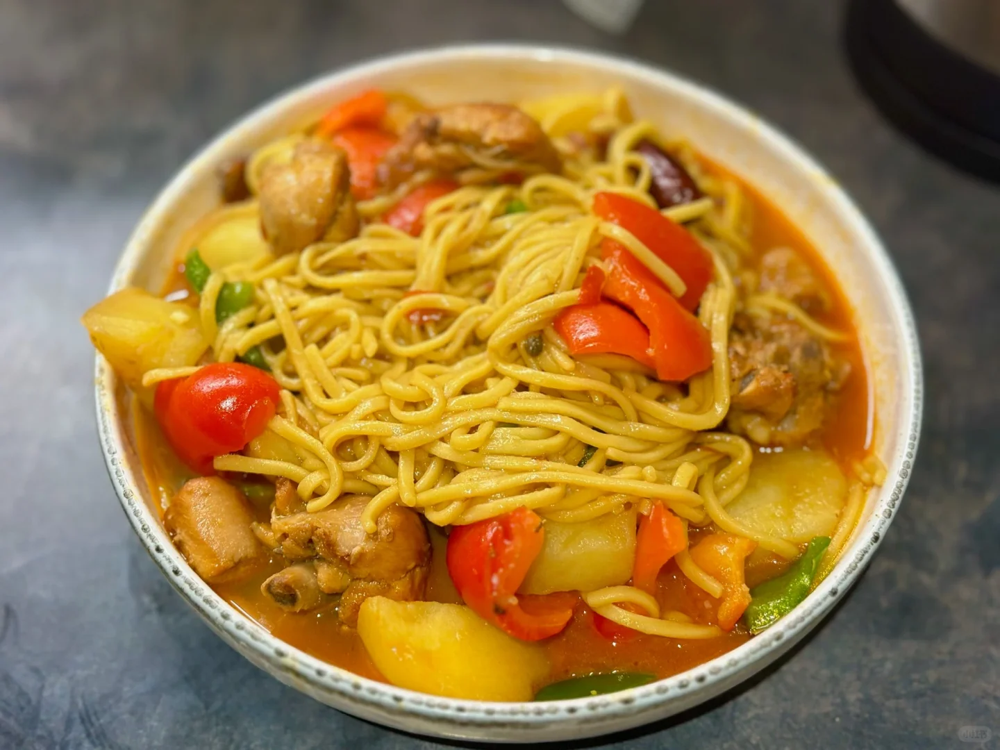

# 大盘鸡面

🥄第23道菜——大盘鸡面🍲
🥬🥩食材：鸡腿 土豆 彩椒
🧄🌶️佐料：姜 蒜 桂皮 香叶 八角 干辣椒 冰糖
📜📌做法：
准备：
鸡腿-切块 加 生姜 料酒 葱焯水
鸡腿焯水捞出备用
土豆切滚刀块 青红椒掰成块
干辣椒洗净泡水备用
1. 热锅下冰糖 炒出糖色
2. 下入鸡肉炒匀
3. 下入蒜片 干辣椒 花椒 桂皮 八角 香叶炒匀
4. 两匀生抽 半行蚝油一勺老抽 炒匀
5. 加没过鸡肉的开水炖20分钟 下入土豆
6. 土豆软烂后匀出水多的地方 下入鸡蛋面
7. 面熟后放入彩椒块翻炒均匀出锅

## 图片

