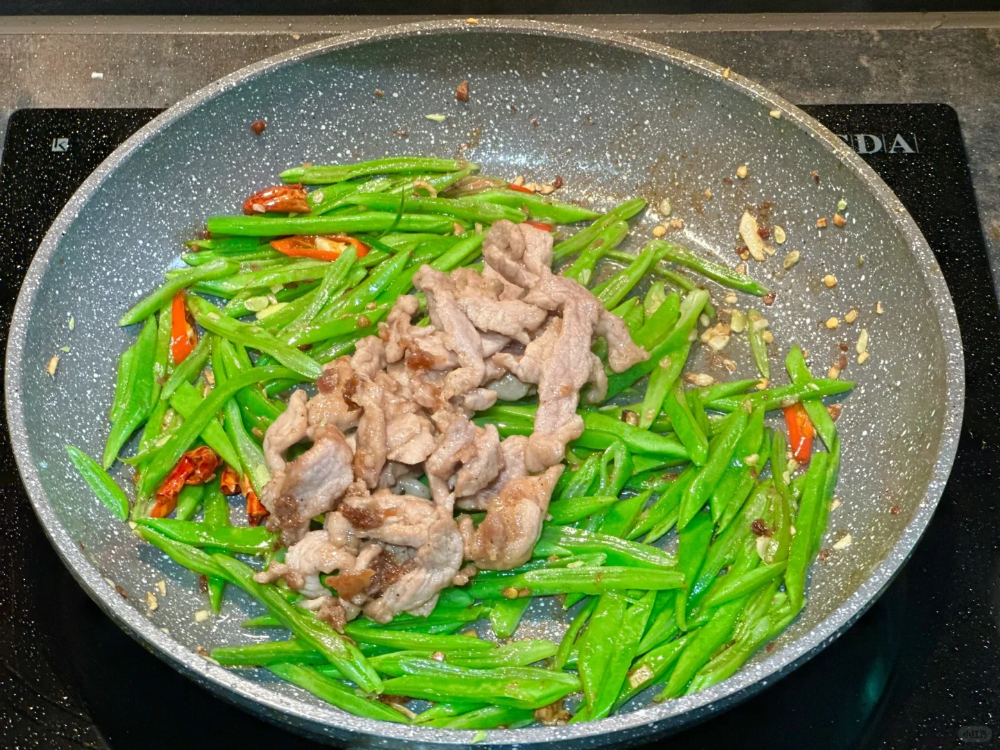
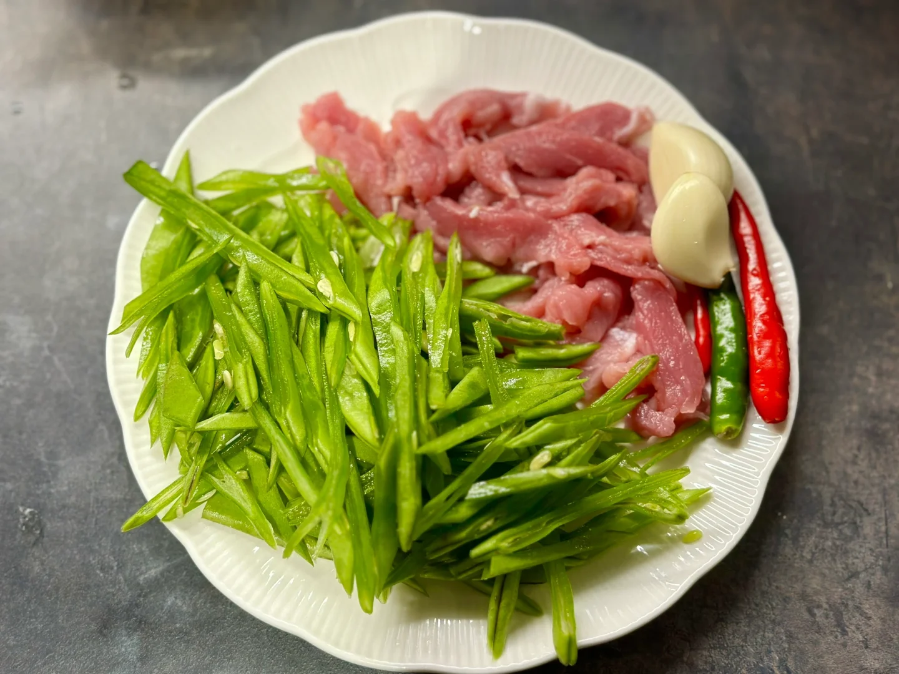
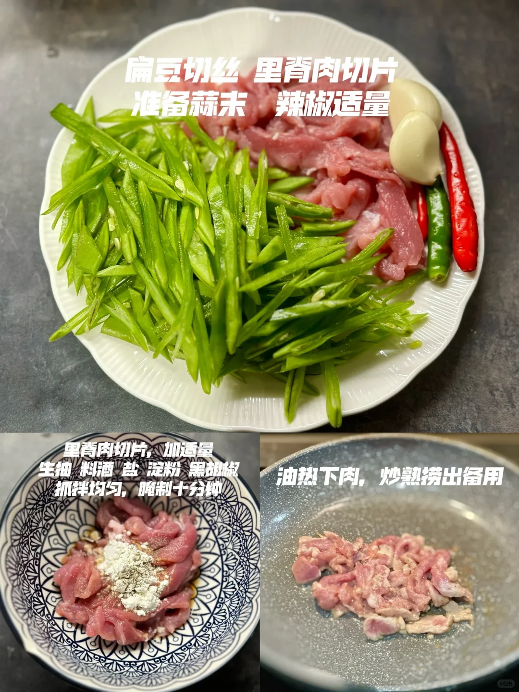
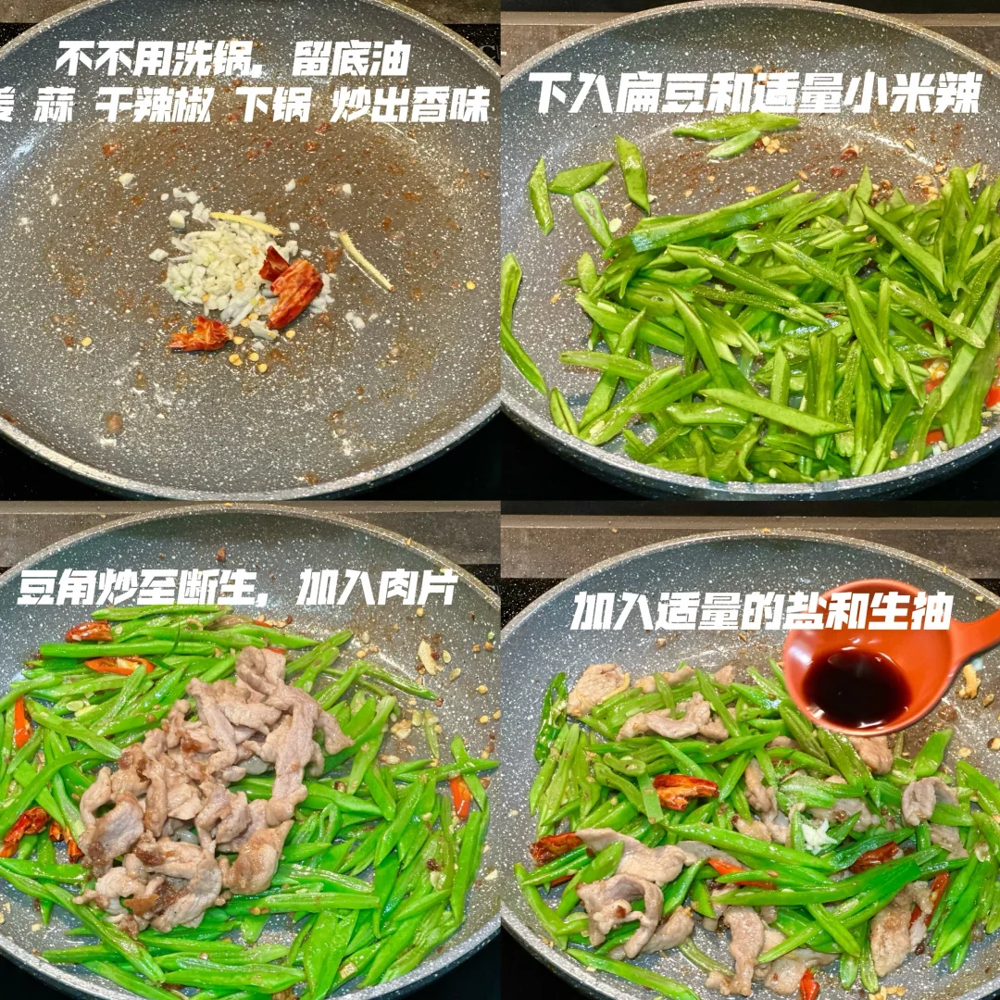
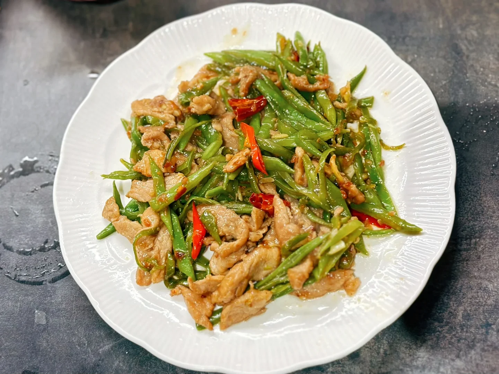

# 扁豆炒肉

🥄第一道菜——扁豆炒肉🍲

最近来姨妈了，清淡点，今日点菜：扁豆炒肉

🥬🥩食材：里脊肉（瘦肉都可）扁豆（豆角也行）

🧄🌶️佐料：蒜，姜，干辣椒，小米辣，淀粉

📜📌做法：
1. 扁豆切丝，里脊肉切片，准备蒜末小米辣；
2. 腌制肉片：加适量生抽，料酒，盐，淀粉，黑胡椒抓拌均匀，腌制十分钟；
3. 烧菜：热锅下肉，炒熟备用；锅中留底油，下入蒜，姜，干辣椒，炒出香味；下入扁豆和小米辣；豆角炒至断生，加入炒熟的肉片；加入适量的盐和生抽，翻炒均匀出锅。

## 图片

