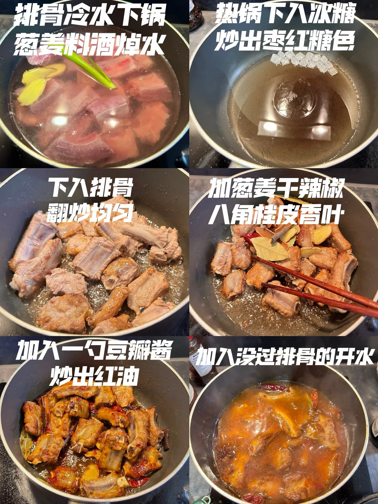
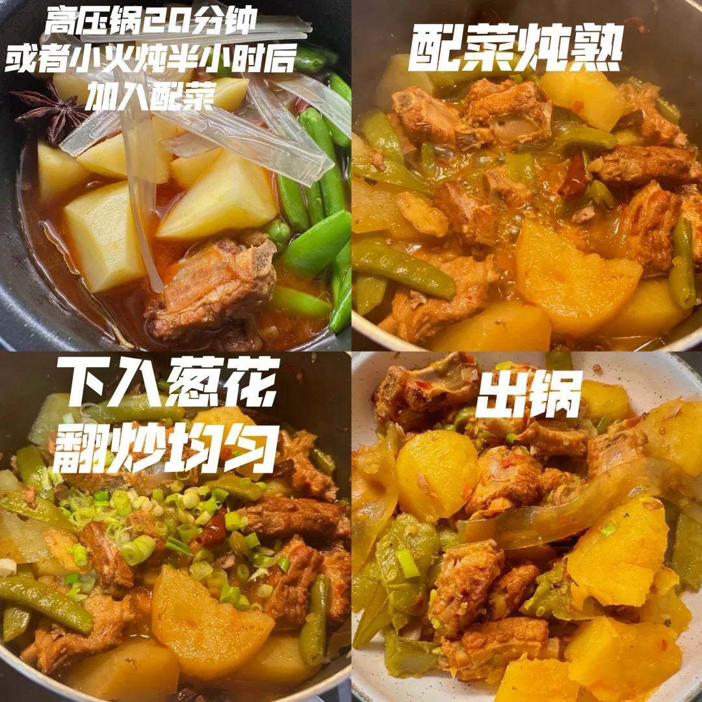
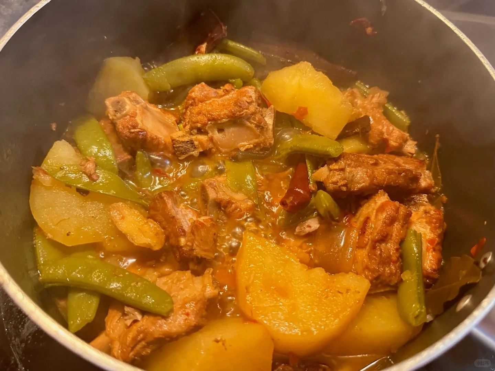
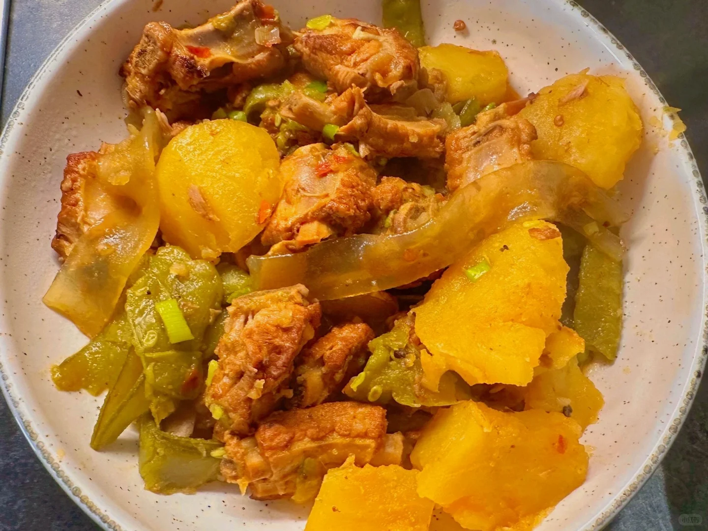
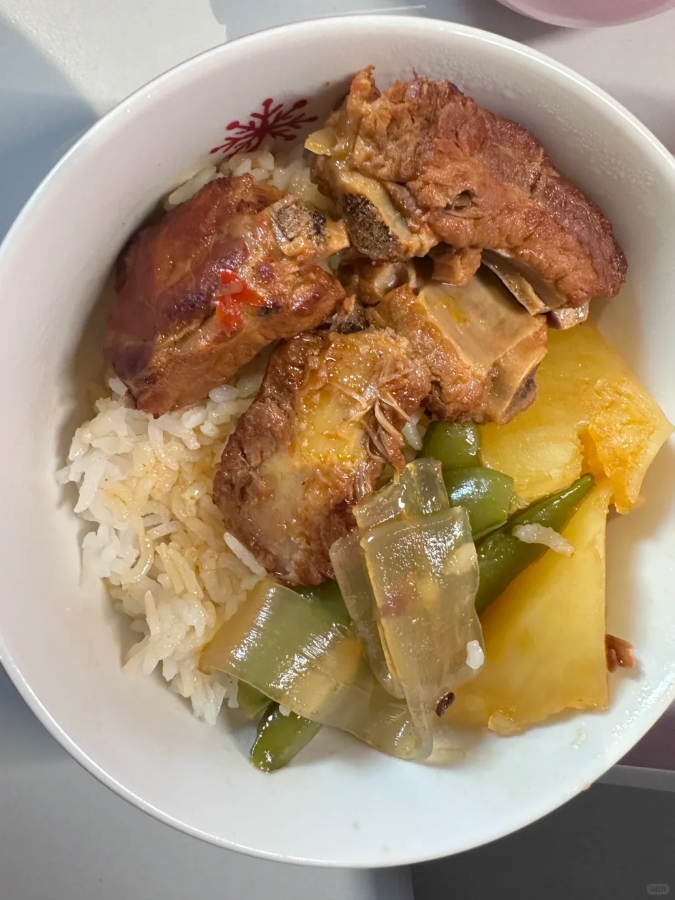

# 排骨炖土豆豆角

🥄第30道菜——排骨炖土豆豆角🍲
🥬🥩食材：猪排骨
🧄🌶️佐料：土豆 豆角 粉条葱，姜干辣椒，八角桂皮香叶
📜📌做法：
1. 排骨冷水下锅 葱姜料酒焯水
2. 热锅下入冰糖 炒出枣红糖色
3. 下入排骨 翻炒均匀
4. 加葱姜干辣椒八角桂皮香叶
5. 加入一勺豆瓣酱 炒出红油
6. 加入没过排骨的开水
7. 高压锅20分钟或者小火炖半小时后加入配菜
8. 配菜炖熟
9. 下入葱花 翻炒均匀
10. 出锅

## 图片

