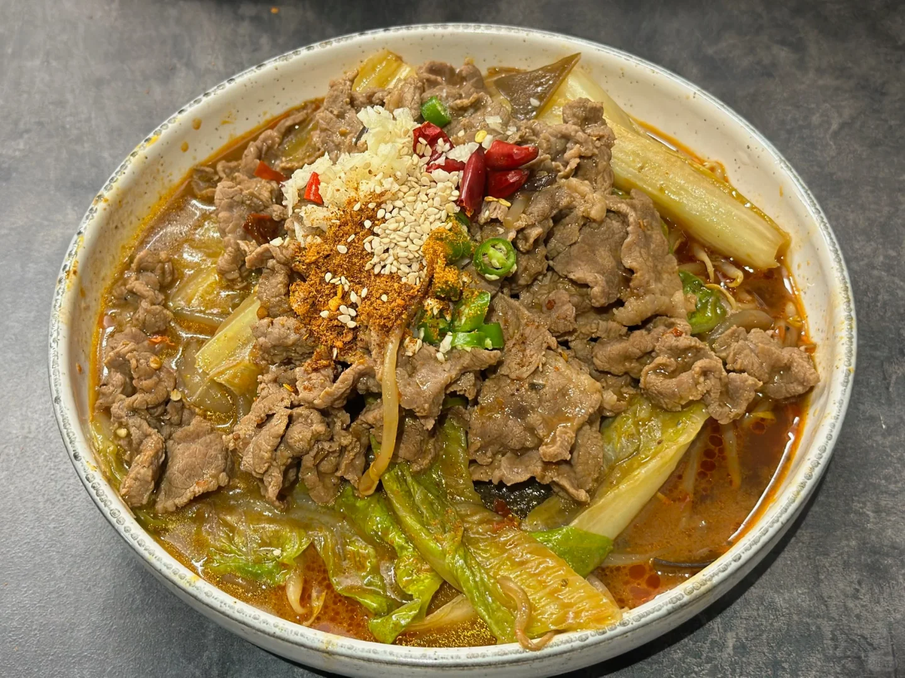
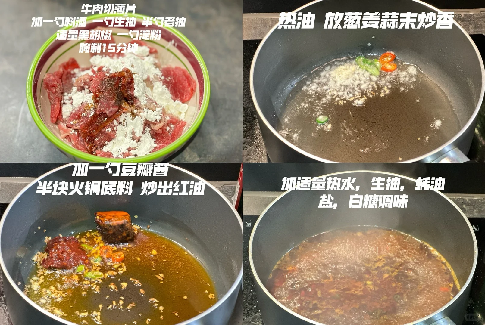
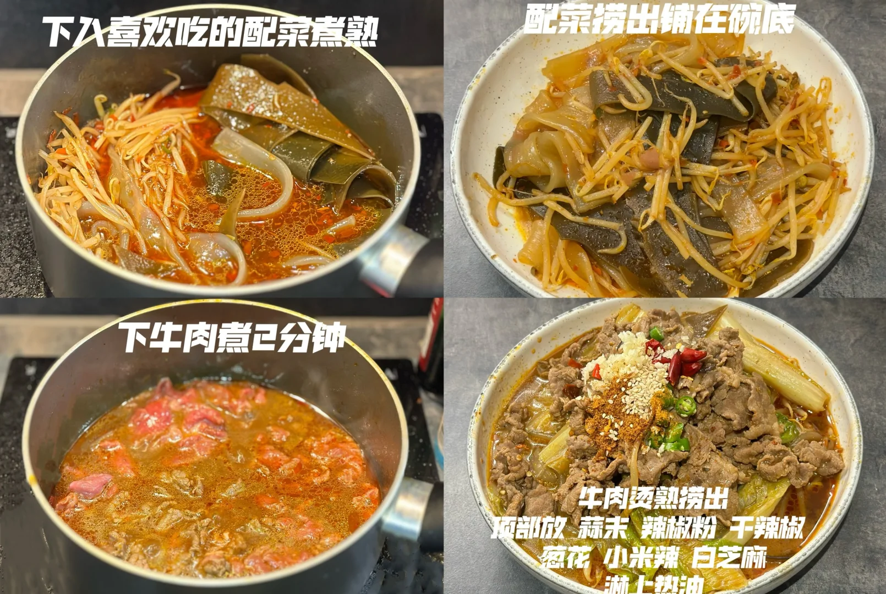

# 水煮牛肉

🥄第6道菜——水煮牛肉🍲

🥬🥩食材：牛肉，all火锅配菜

🧄🌶️佐料：蒜末，小米辣，豆瓣酱，火锅底料，葱花，干辣椒，白芝麻

📜📌做法：
准备：

牛肉切薄片，加一勺料酒 一勺生抽 半勺老抽，适量黑胡椒 一勺淀粉，腌制15分钟；
喜欢吃的配菜。

1. 热油 放葱姜蒜末炒香 。
2. 将一勺豆瓣酱，半块火锅底料，炒出红油。
3. 加适量热水，生抽，蚝油，盐，白糖调味。
4. 下入喜欢吃的配菜煮熟捞出铺在碗底。
5. 下入牛肉煮2分钟， 牛肉汤汁倒入碗中。
6. 顶部放蒜末，辣椒粉，干辣椒，葱花，小米辣，白芝麻，淋上热油。

## 图片

