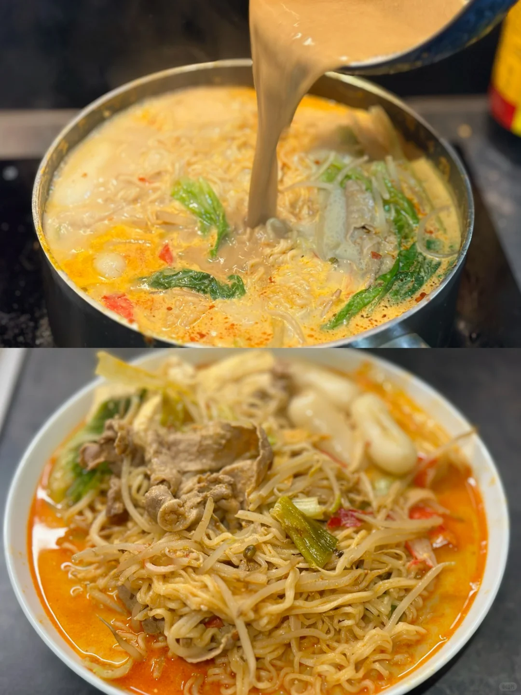
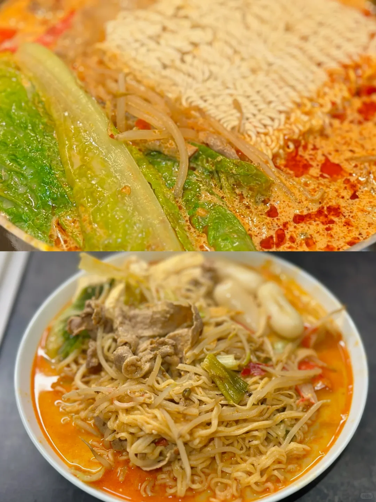
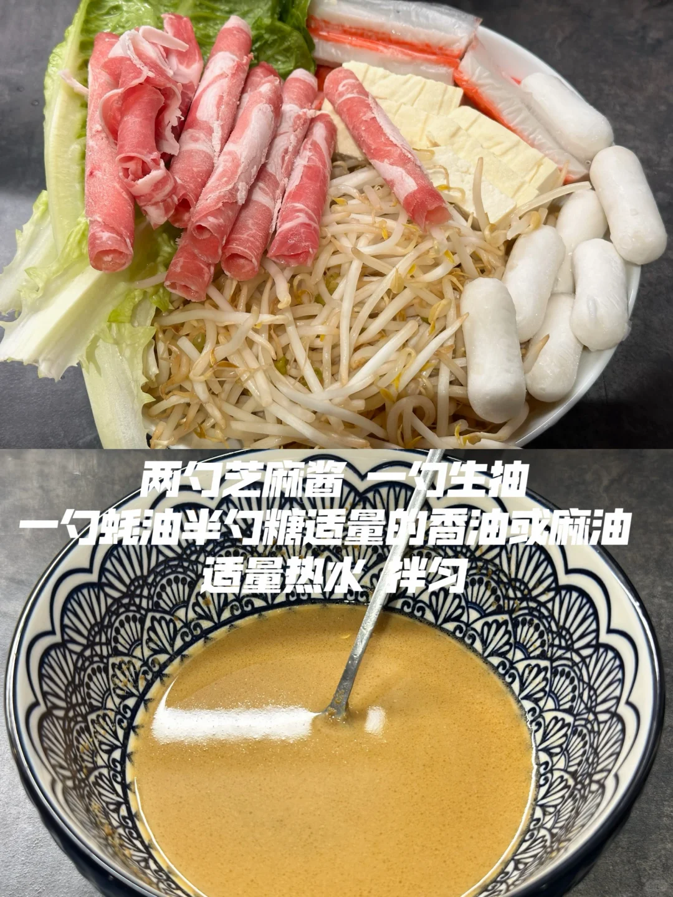
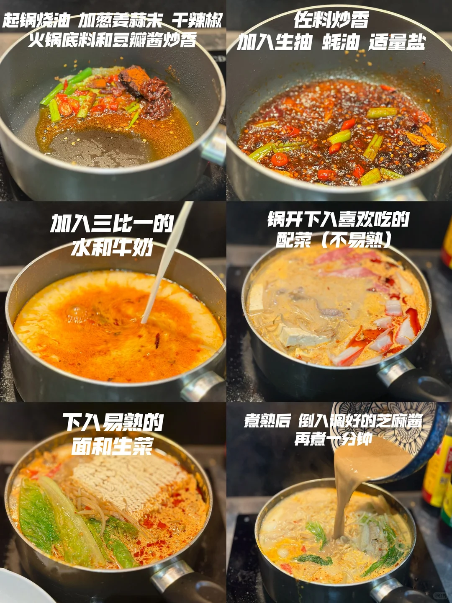
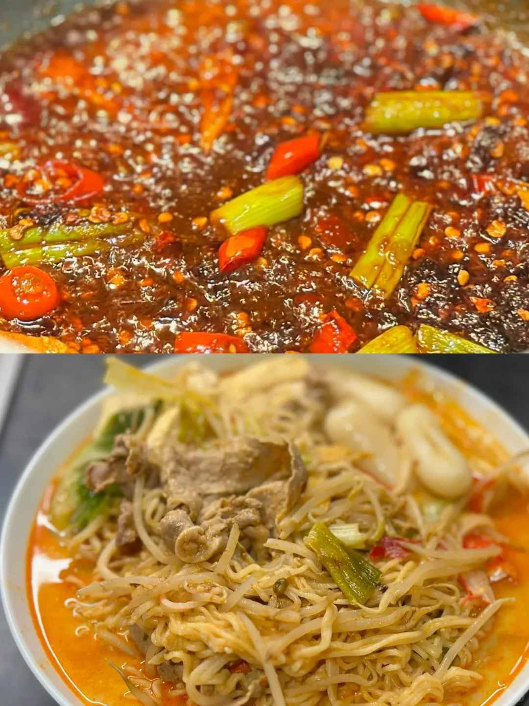

# 牛奶麻辣烫

🥄第21道菜——牛奶麻辣烫🍲
🥬🥩食材：肥牛卷 豆芽 宽粉等火锅食材
🧄🌶️佐料：葱 蒜 小米辣 火锅底料
📜📌做法：
准备：
1. 起锅烧油 加葱 姜 蒜 干辣椒 火锅底料和豆瓣酱炒香
2. 佐料炒香 加入生抽 蚝油 适量盐
3. 加入三比一的水和牛奶
4. 锅开下入喜欢吃的配菜（不易熟）
5. 下入易熟的面和生菜
6. 煮熟后 倒入调好的芝麻酱 再煮一分钟

## 图片

