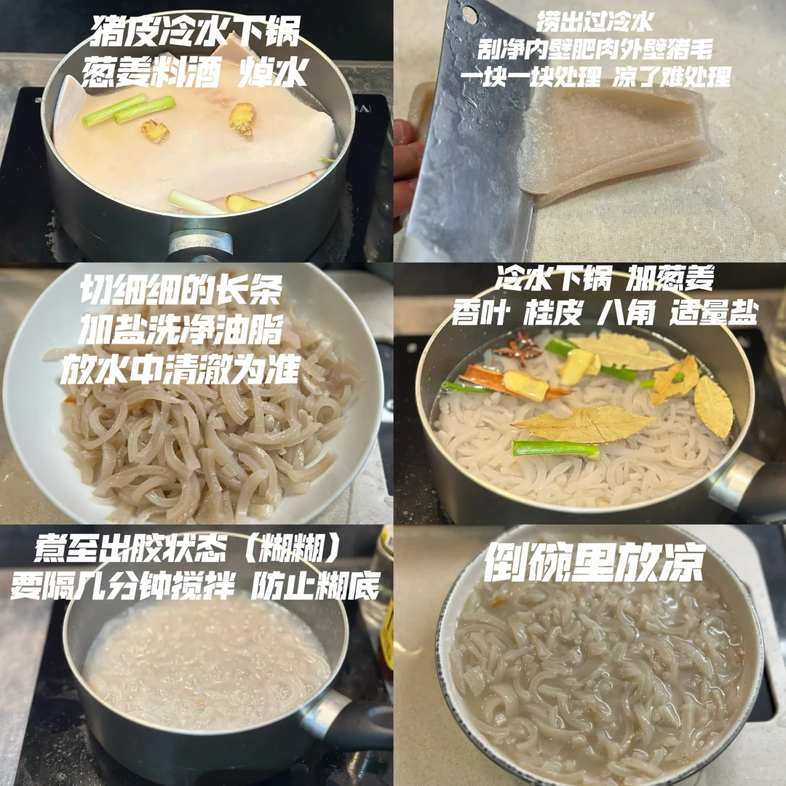
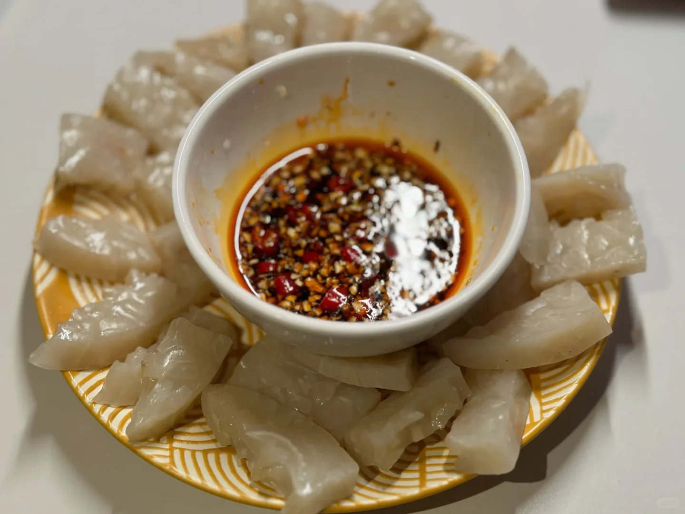

# 猪皮冻

🥄第二十五道菜——猪皮冻🍲

🥬🥩食材：猪皮

🧄🌶️佐料：葱姜 香叶 桂皮 八角

📜📌做法：
1. 猪皮冷水下锅 葱姜粉酒 焯水
2. 捞出过冷水 刮净内壁肥肉外壁猪毛（一块一块处理 凉了难处理）
3. 切至细长条 加盐洗净油脂 放水中清澈为准
4. 冷水下锅 加葱姜 香叶 桂皮 八角 适量盐
5. 煮至出胶状（糊糊） 要隔几分钟搅拌 防止糊底
6. 倒碗里放凉

吃的时候切块状 蘸小料 贼香。

## 图片

