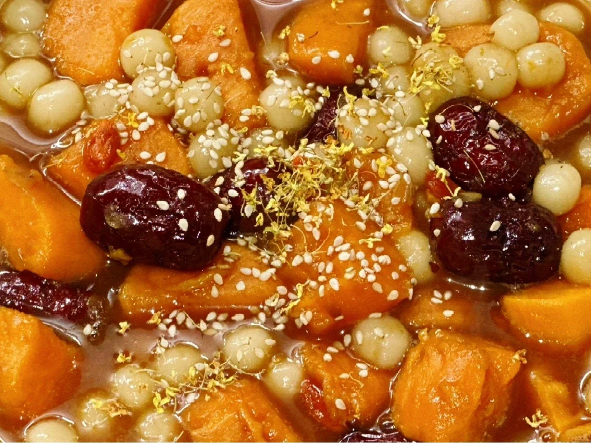
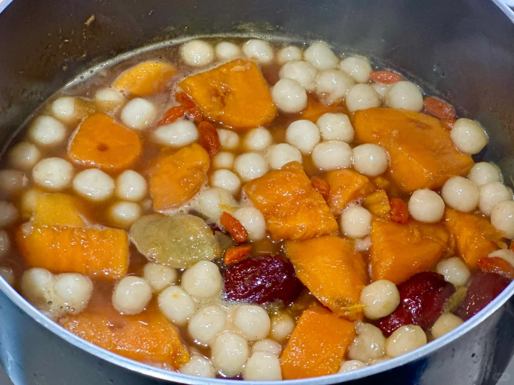
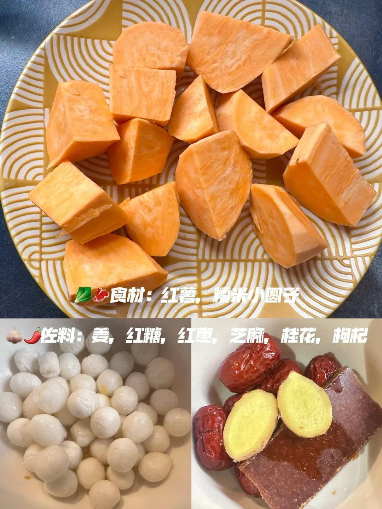
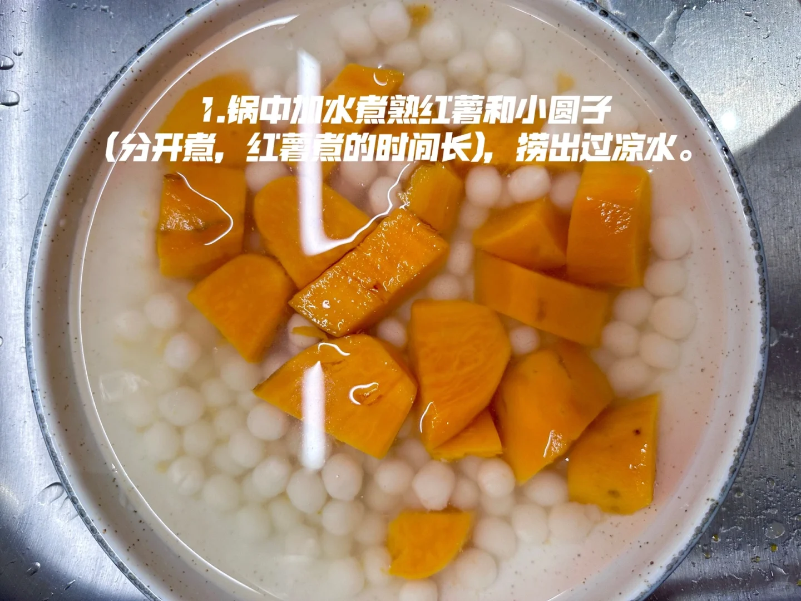
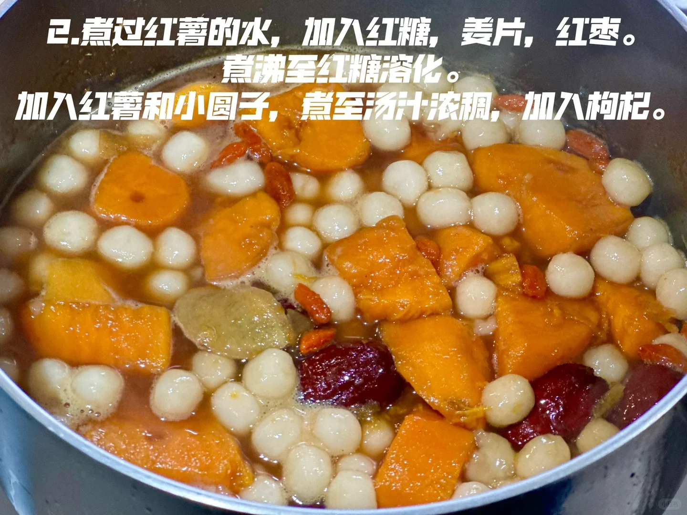
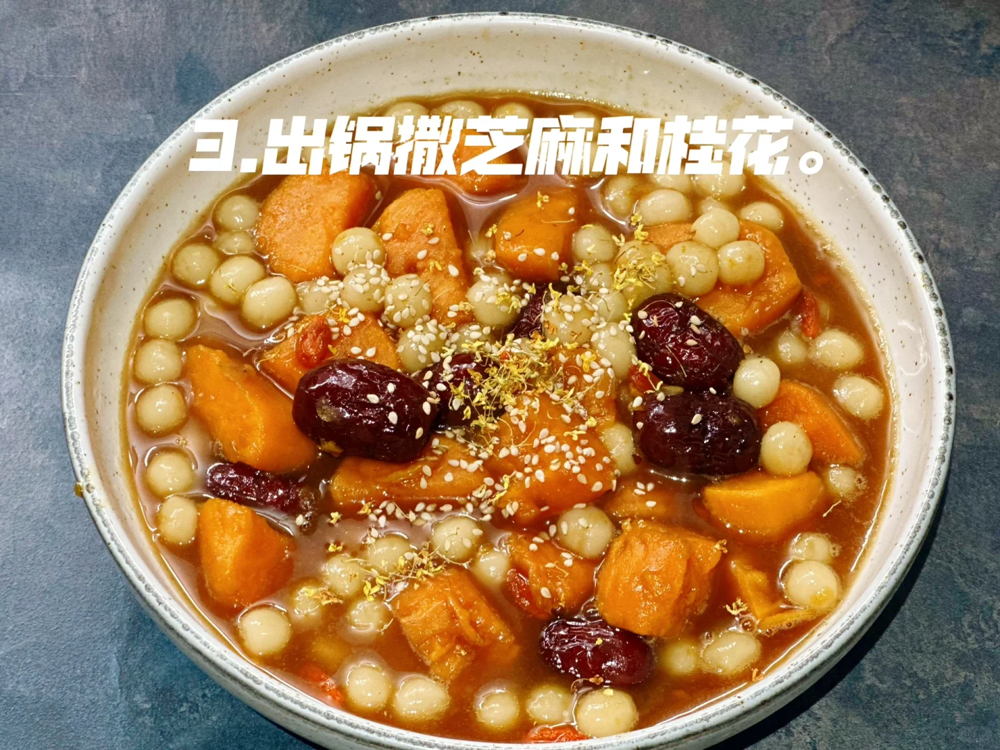

# 红糖红薯小圆子

🥄第二道菜——红糖红薯小圆子🍲

最近来姨妈了，吃点补血的食物：红糖红薯小圆子。

🥬🥩食材：红薯，糯米小圆子

🧄🌶️佐料：姜，红糖，红枣，芝麻，桂花，枸杞

📜📌做法：

1. 锅中加水煮熟红薯和小圆子(分开煮，红薯煮的时间长)，捞出过凉水。

2. 煮过红薯的水，加入红糖，姜片，红枣。煮沸至红糖溶化。

3. 加入红薯和小圆子，煮至汤汁浓稠，加入枸杞，搅拌均匀，出锅撒芝麻和桂花。

## 图片

