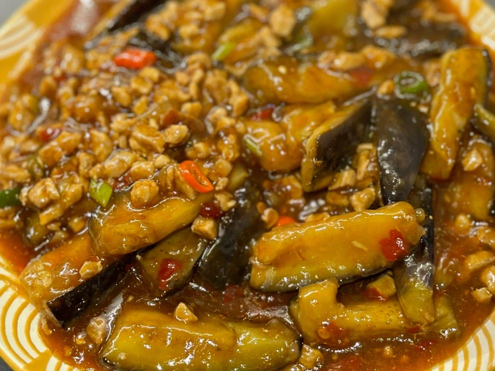
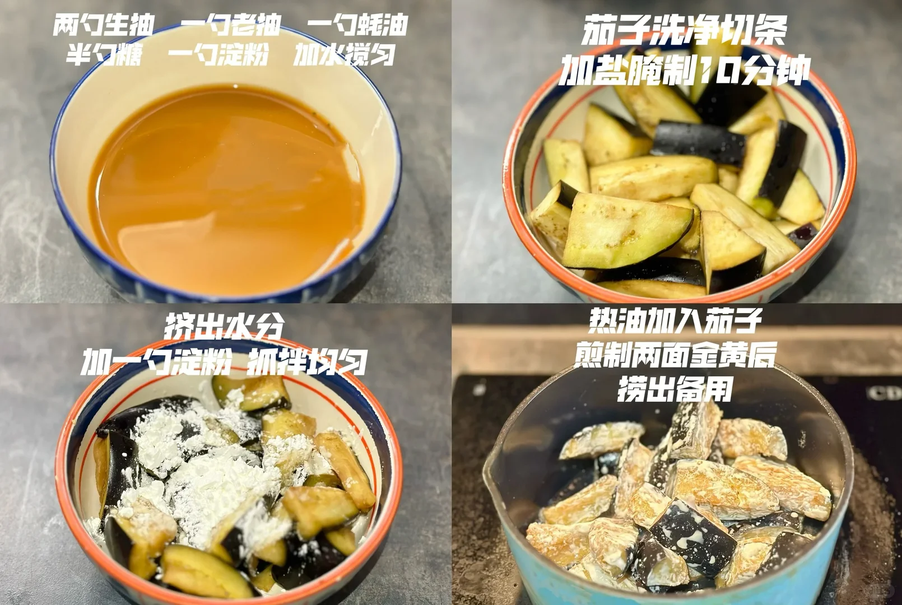
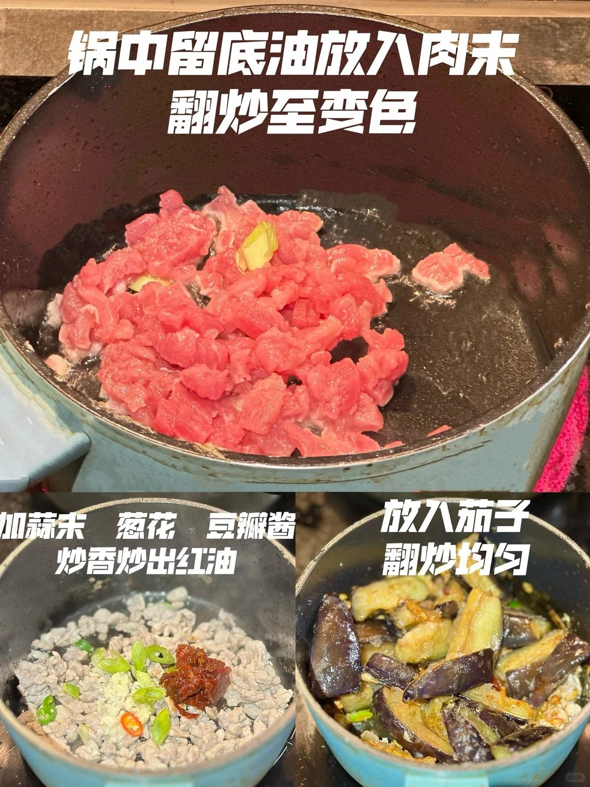
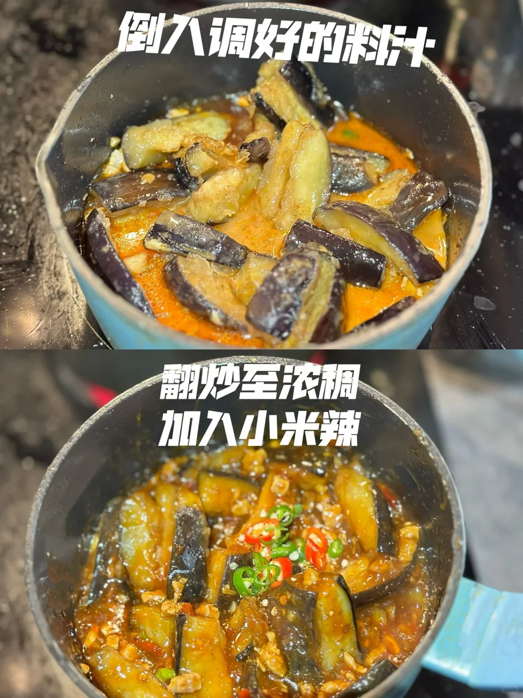

# 肉末茄子

🥄第5道菜——肉末茄子🍲

🥬🥩食材：茄子，瘦肉

🧄🌶️佐料：蒜末，小米辣，豆瓣酱，葱花，淀粉

📜📌做法：

准备料汁：两勺生抽，一勺蚝油，一勺老抽，适量半勺糖，少量水

1. 茄子洗净切条加盐腌制10分钟。

2. 挤出茄子中的水分加一勺淀粉，抓拌均匀。

3. 热油加入茄子煎至两面金黄后捞出备用。

4. 锅中留底油放入肉末，翻炒至变色。

5. 加蒜末 葱花 豆瓣酱 炒香炒出红油。

6. 放入茄子，翻炒均匀。

7. 到调好的料汁。

8. 翻炒至浓稠，加入小米辣。

## 图片

