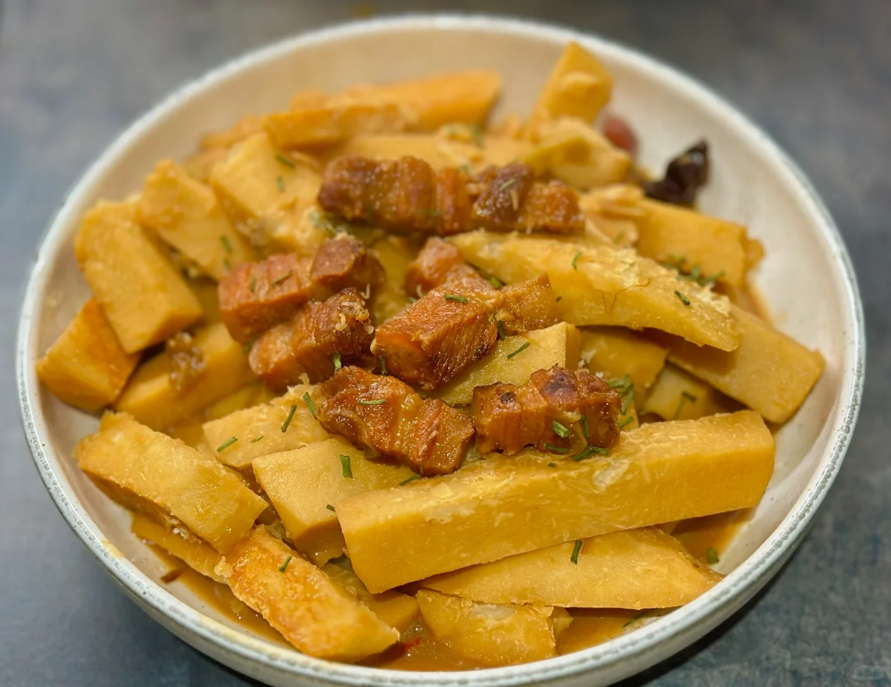
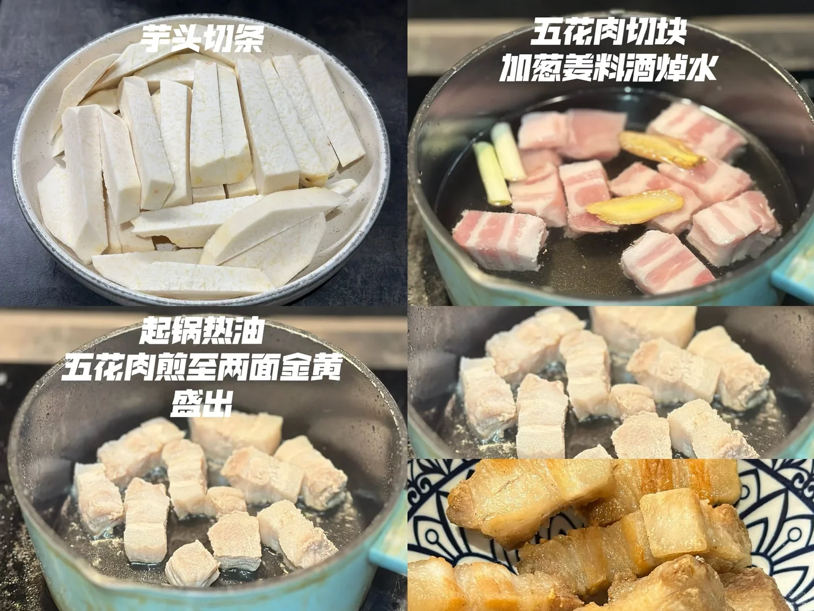
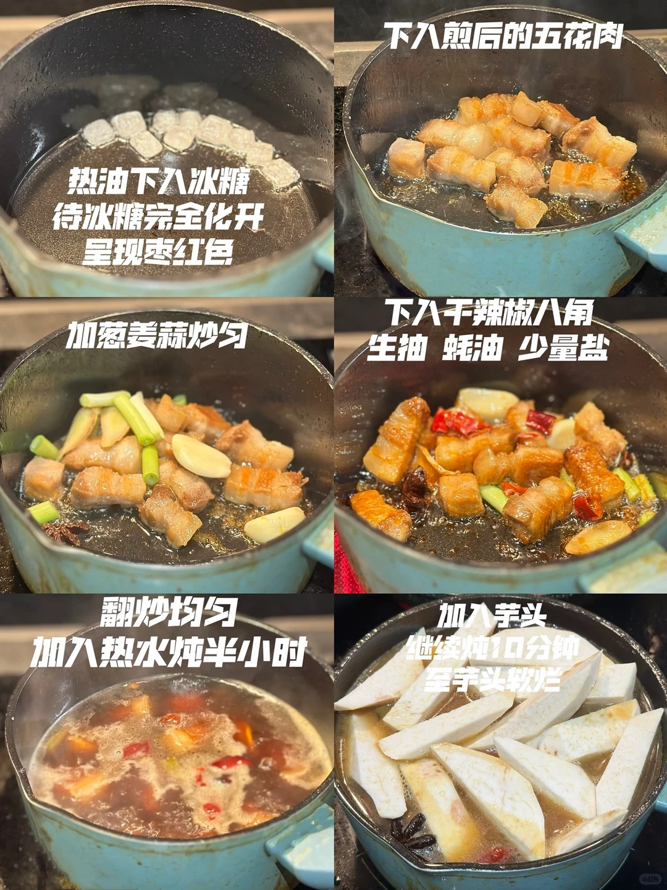
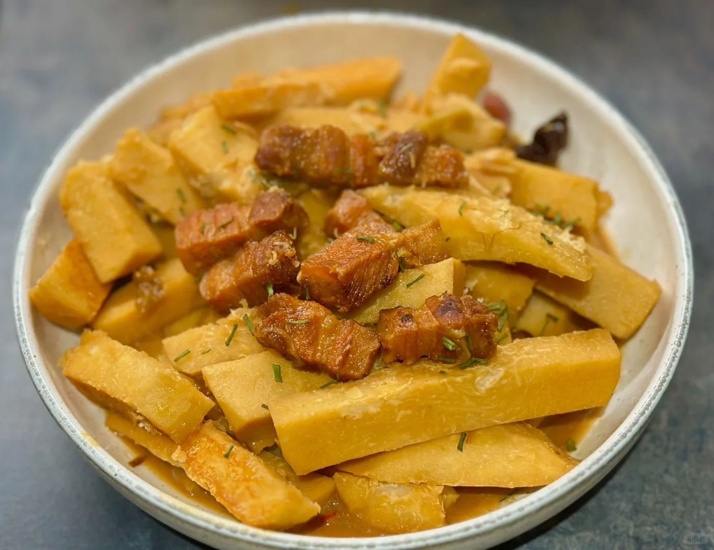

# 芋头炖五花肉

🥄第13道菜——芋头炖五花肉🍲
🥬🥩食材：芋头 五花肉
🧄🌶️佐料：冰糖 辣椒
📜📌做法：
准备：
五花肉
切块 生姜料酒，葱，焯水
芋头切条
1. 五花肉加葱姜料酒焯水
2. 起锅热油五花肉煎至两面金黄盛出
3. 热油下入冰糖 待冰糖完全化开呈现枣红色
4. 下入煎后的五花肉
5. 加葱姜蒜炒匀
6. 下入干辣椒八角 生抽 蚝油 少量盐
7. 翻炒均匀加入热水炖半小时
8. 加入芋头 继续炖10分钟至芋头软烂
      的吃法

## 图片

