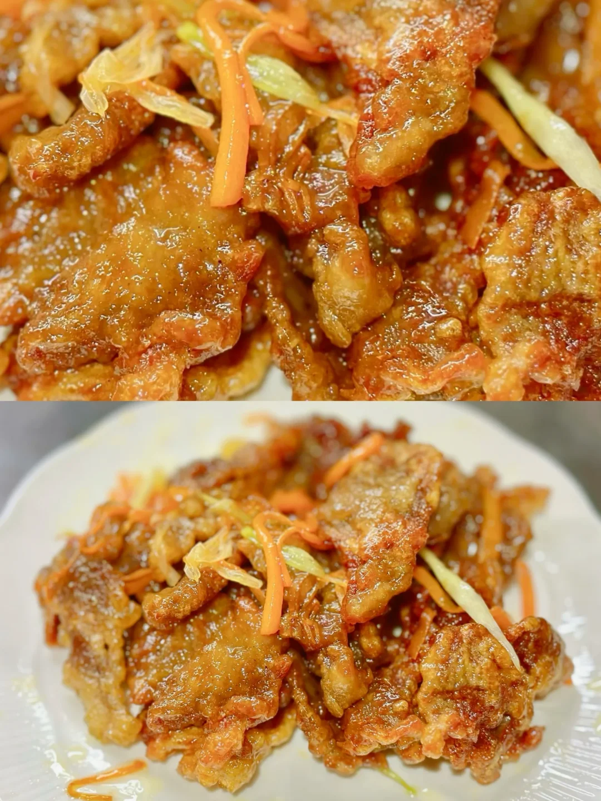
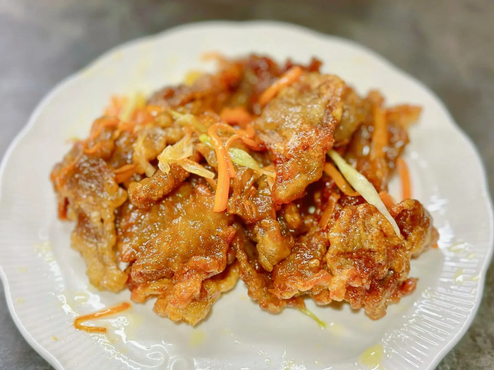
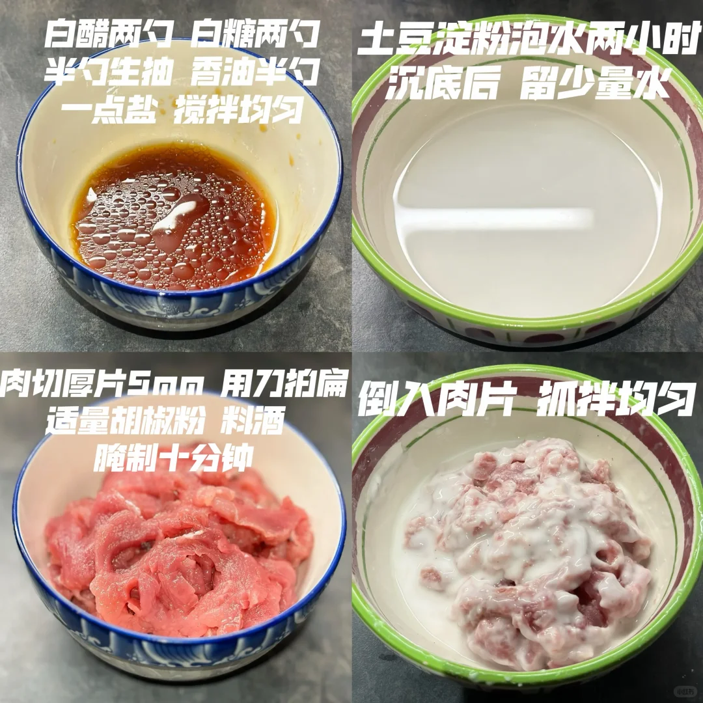
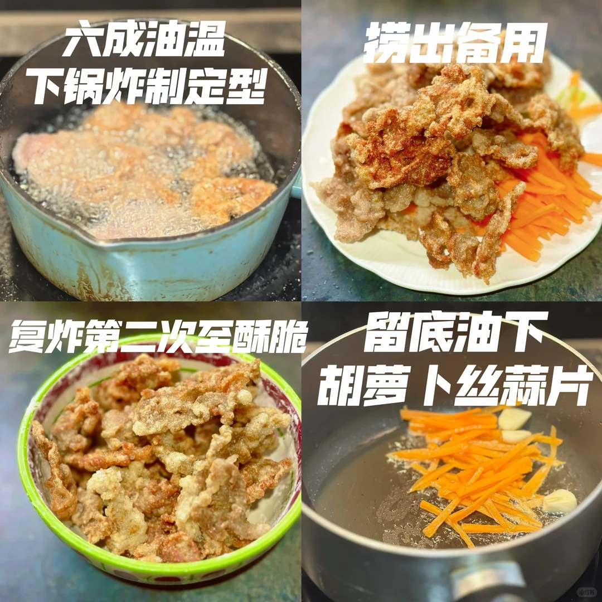
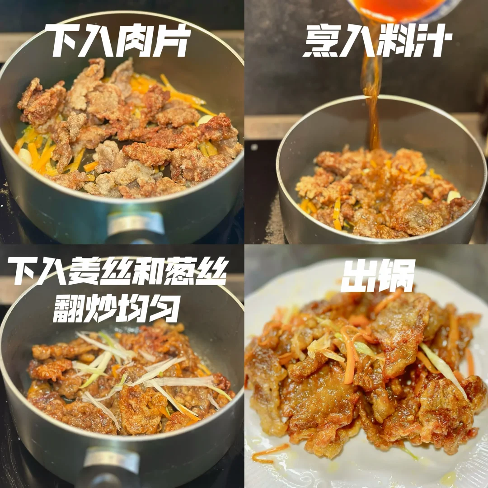

# 锅包肉

🥄第29道菜——锅包肉🍲

🥬🥩食材：猪里脊肉 胡萝卜丝
🧄🌶️佐料：土豆淀粉葱丝 姜丝 蒜片 白醋 白糖 胡椒粉 盐

📜📌做法：

准备工作
1. 白酷两勺白糖两勺 半勺香油 半勺生抽 行一点盐 搅拌均匀
2. 土豆淀粉泡水两小时 沉底后 留少量水
3. 肉切厚片5nm 用力拍扁 适量胡椒粉 料酒
4. 倒入肉片 抓拌均匀

起锅
1. 六成油温 下锅炸制定型 捞出备用
2. 复炸第二次至酥脆
3. 留底油 下入 胡萝卜丝蒜片
4. 下入肉片 烹入料汁
5. 下入葱丝姜丝  翻炒均匀
6. 出锅

## 图片

