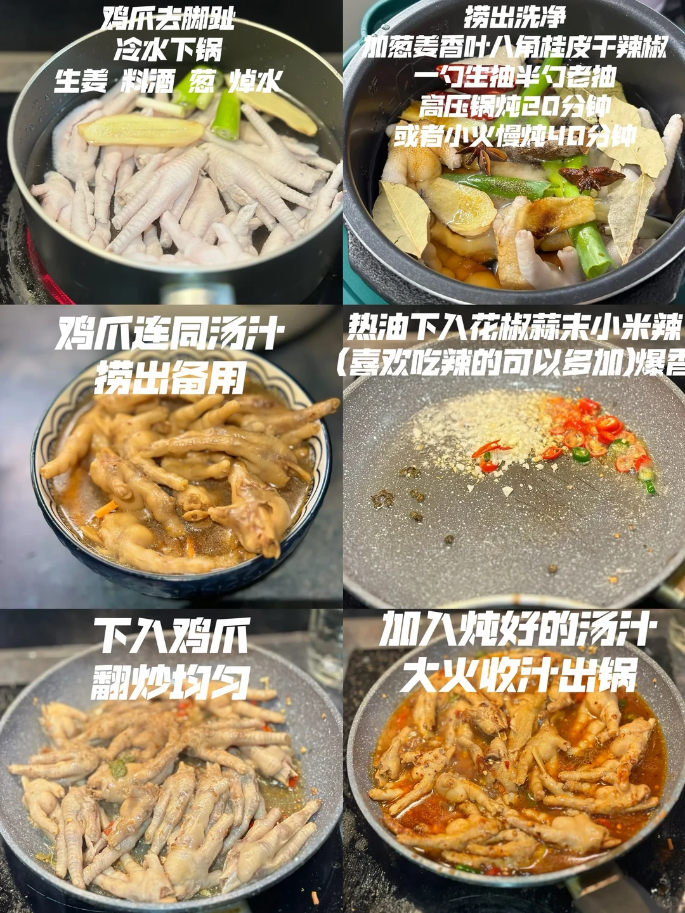
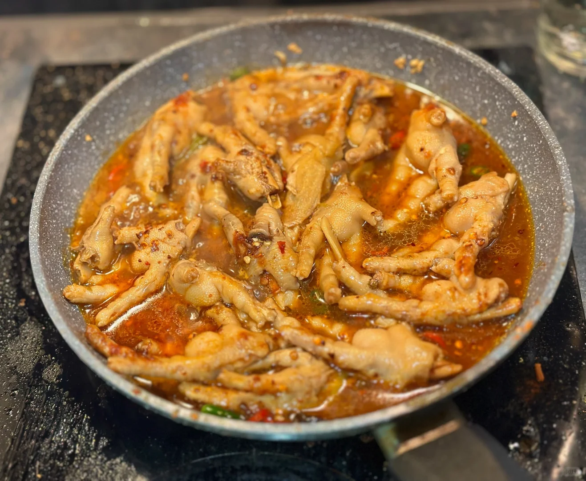
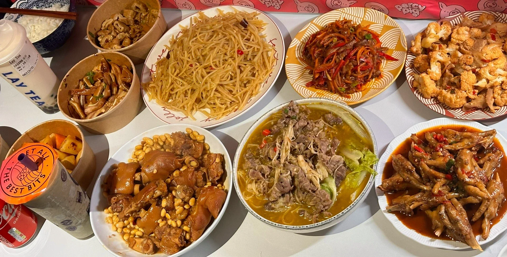

# 香辣鸡爪

🥄第二十八道菜——香辣鸡爪🍲

🥬🥩食材：鸡爪

🧄🌶️佐料：葱姜蒜小米辣

📜📌做法：

1. 鸡爪去脚趾 冷水下锅加 生姜 料酒 葱 焯水

2. 鸡爪捞出洗净 加 葱 姜 香叶 八角 桂皮 干辣椒 一勺生抽 半勺老抽 高压锅炖20分钟或者小火慢炖40分钟
3. 鸡爪连同汤汁捞出备用

4. 热油下入花椒 蒜末 小米辣（喜欢吃辣的可以写加）爆香

5. 下入鸡爪翻炒均匀

6. 加入炖好的汁大火收汁 出锅

## 图片

