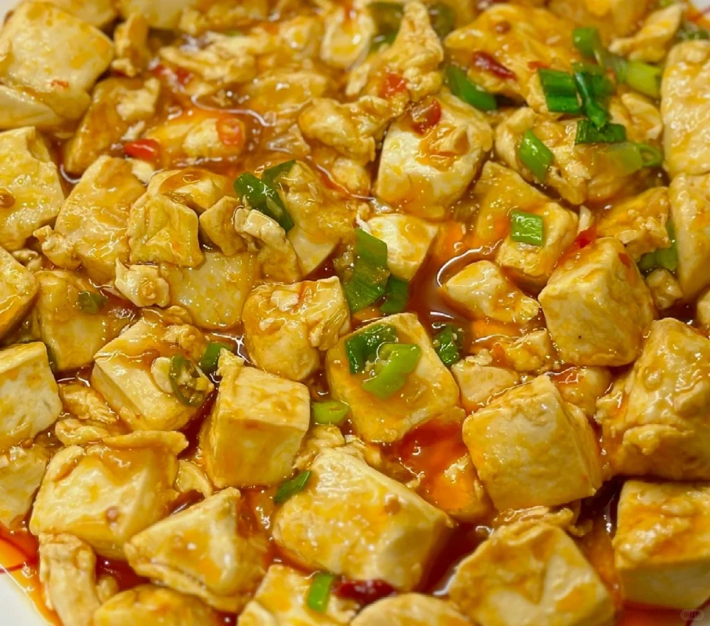
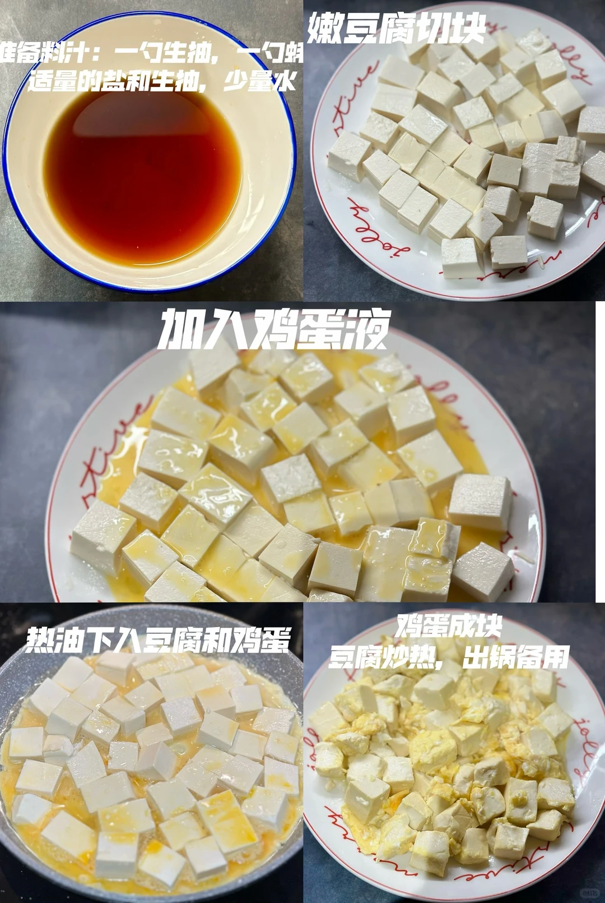
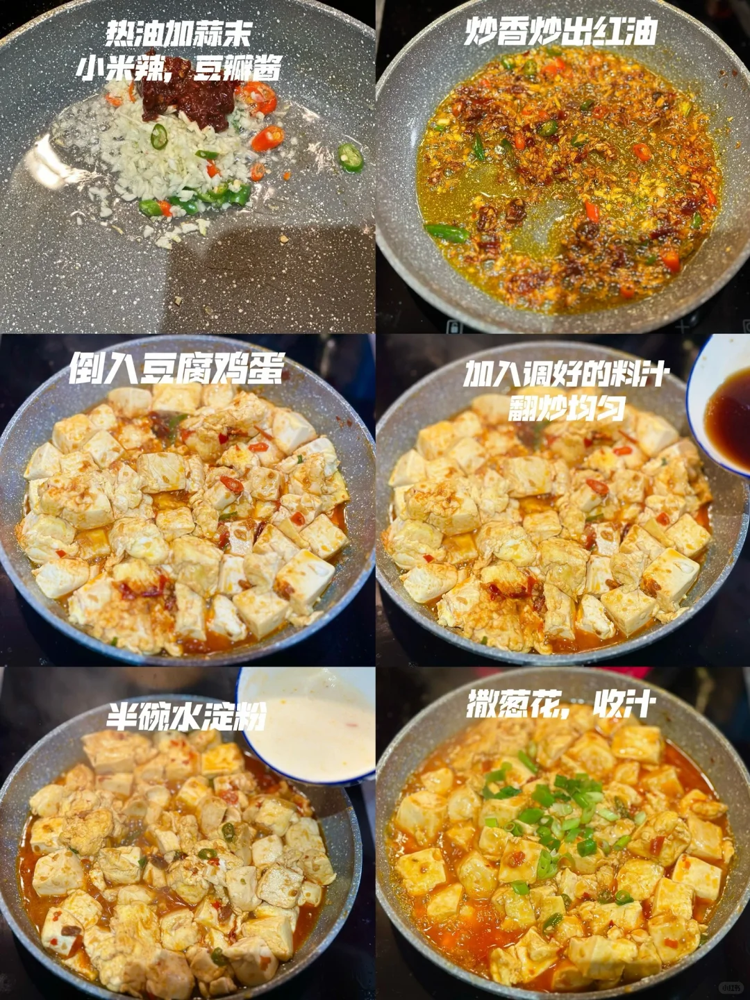
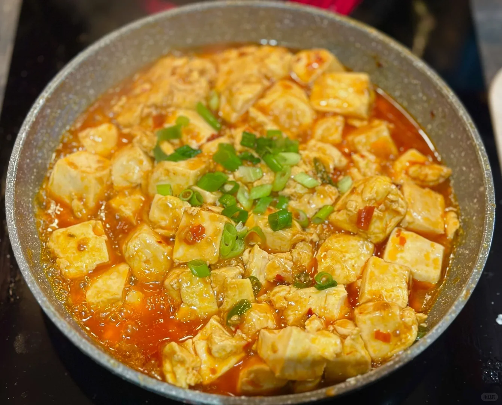

# 鸡蛋抱豆腐

🥄第四道菜——鸡蛋抱豆腐🍲

🥬🥩食材：鸡蛋，嫩豆腐

🧄🌶️佐料：蒜末，小米辣，豆瓣酱

📜📌做法：

准备料汁：一勺生抽，一勺蚝油，适量的盐和生抽，少量水

1. 嫩豆腐切块。

2. 加入鸡蛋液。

3. 热油下入豆腐和鸡蛋。

4. 鸡蛋成块，豆腐炒热出锅备用。

5. 热油加蒜末，小米辣，豆瓣酱。

6. 炒香炒出红油。

7. 倒入豆腐鸡蛋。

8. 加入调好的料汁，翻炒均匀。

9. 半碗水淀粉。

10. 撒葱花，收汁。

## 图片

