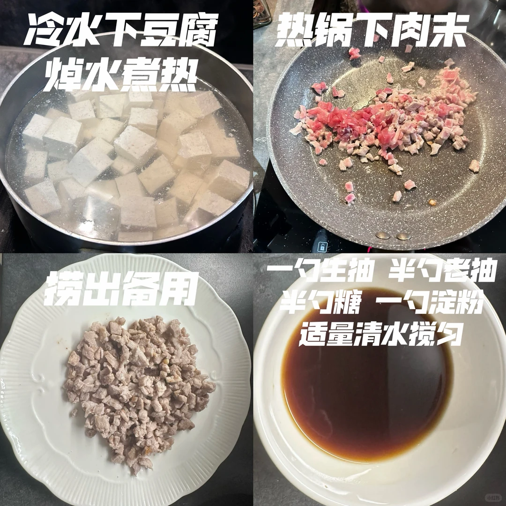
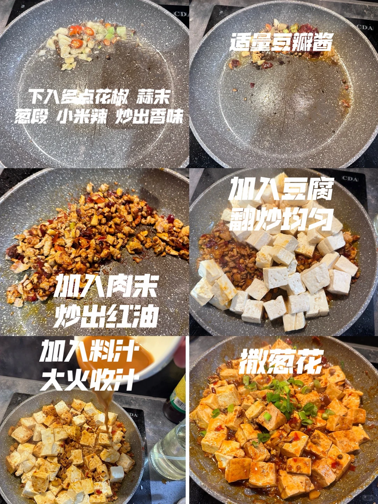
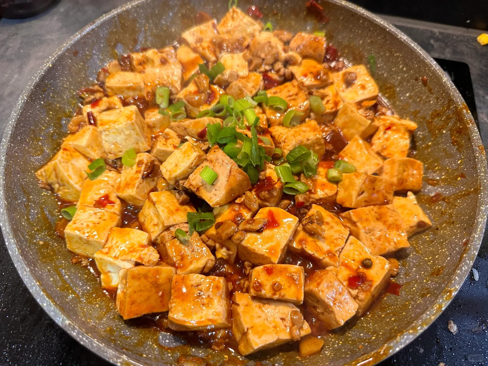
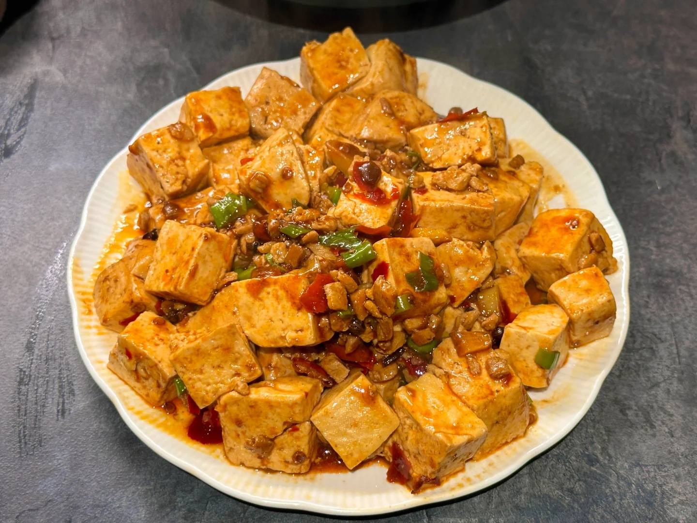

# 麻婆豆腐

🥄第32道菜——麻婆豆腐🍲

🥬🥩食材：豆腐（不能用嫩豆腐）

🧄🌶️佐料：花椒 蒜末葱段 豆瓣酱

📜📌做法：

准备：
1. 冷水下豆腐 焯水煮热
2. 热锅下肉末 捞出备用
3. 一勺生油 半勺老抽 半勺糖 一勺淀粉 造量清水搅匀

1. 下入多点花椒 蒜末 葱段 小米辣 炒出香味
2. 加入适量豆瓣酱 肉未 炒出红油
3. 加入豆腐 翻炒均匀
4. 加入料汁 大火收汁
5. 撒葱花

## 图片

