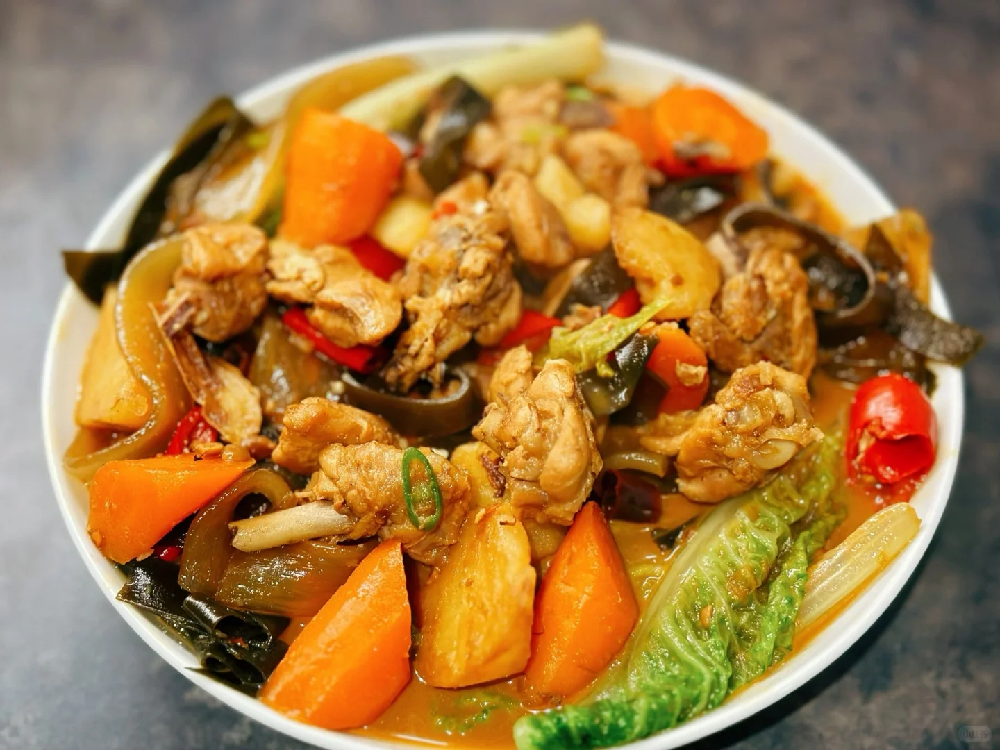
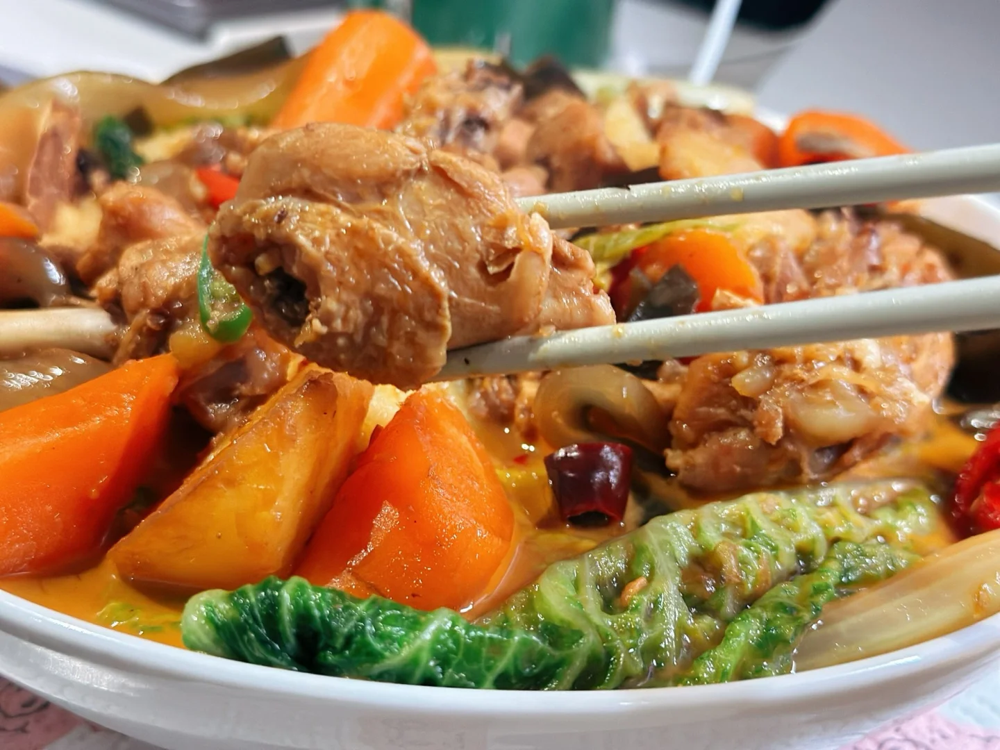
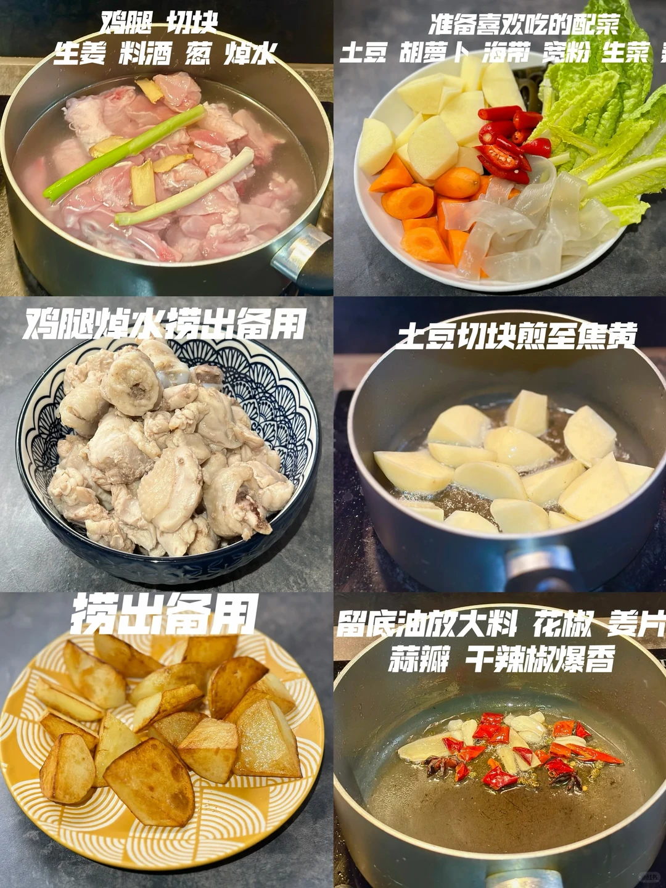
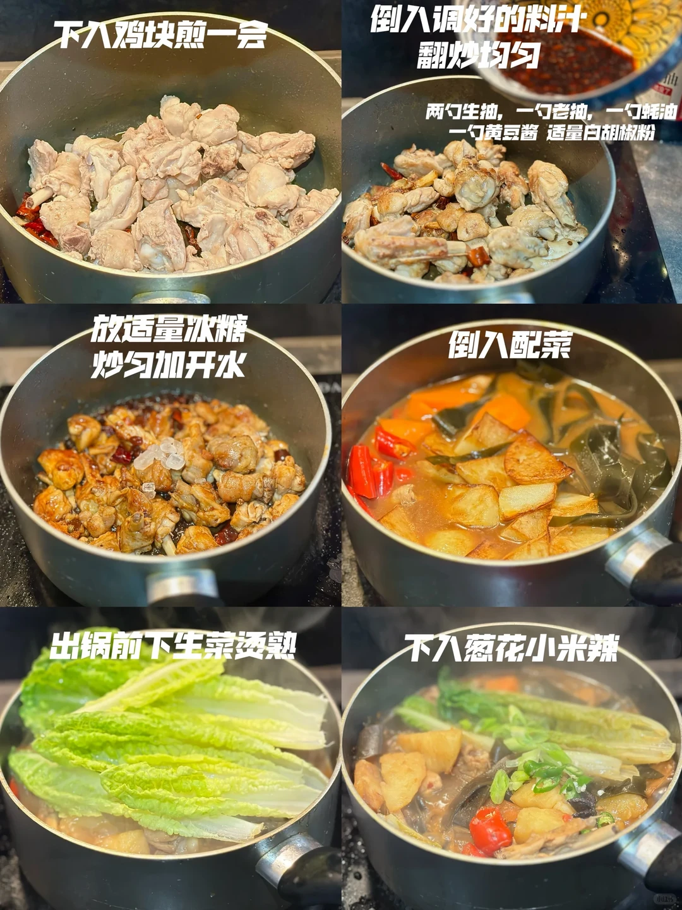
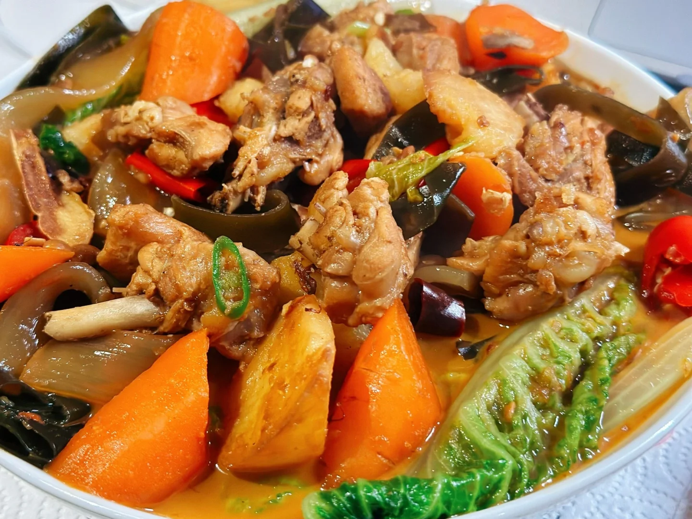

# 黄焖鸡

🥄第8道菜——黄焖鸡🍲

英国超市一磅的鸡腿，每次遇到必拿

🥬🥩食材：鸡腿
🧄🌶️佐料：土豆 胡萝卜 海带 宽粉 生菜

📜📌做法：

准备：

鸡腿 切块 生姜料酒，葱，焯水

准备喜欢吃的配菜， 土豆 胡萝卜 海带 宽粉 生菜

两勺生抽，一勺老抽，一勺蚝油，一勺黄豆酱 适量白胡椒粉

1. 鸡腿焯水捞出备用。
2. 土豆切块煎至焦黄，盛出备用。
3. 留底油放大料，花椒姜片，蒜瓣干辣椒爆香。
4. 下入鸡块煎一会。
5. 倒入调好的料汁，翻炒均匀。
6. 放适量冰糖，炒匀加开水
7. 倒入配菜
8. 出锅前下生菜烫熟
9. 下入葱花小米辣

## 图片

